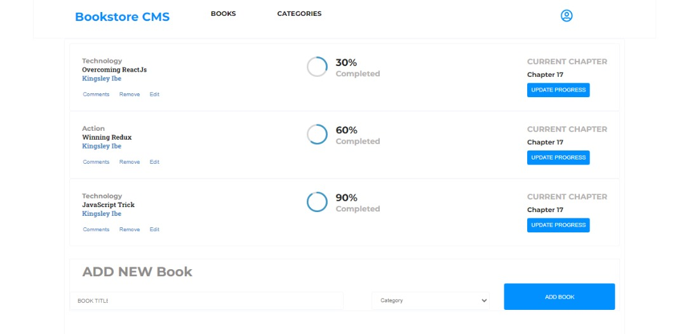

# Bookstore Application

> "Bookstore Application" is an MVP version of it's kind that allows you to:
- Display a list of books.
- Add a book.
- Remove a selected book.

The application was built using Javascript, React-Redux, SASS.

## Project Screenshot


## Live Video Demo


## Other Important Information
## Built With

- Basic Language - JavaScript 
- Framework - React
- Other technologies/tools: 

``` create-react-app
    > create-react-app
    > webpack for bundling files
    > Babel for code transpiling
    > Git for version control
    > Eslint for JavaScript linting
    > Stylelint for style linting
    > Jest for testing
 ```

## Live Demo

- [Live Demo Link](https://kingsleyibe.github.io/bookstore/)


## Getting Started

To get a local copy up and running follow these simple example steps.

### Prerequisites
- You should have basic knowledge of HTML.
- You should have basic knowledge of JavaScript.
- You should have basic knowledge of CSS.
- You should have basic knowledge of webpack.
- Also, a basic knowledge of git and github.
- A code editor: I used VScode for this project but you can use any code editor of your choice.
### Setup
- follow steps on this link to set up VScode code editor: [setup vscode](https://www.freecodecamp.org/news/how-to-set-up-vs-code-for-web-development/)

### Install
- [download](https://code.visualstudio.com/download) VScode.
[Watch this video](https://www.youtube.com/watch?v=MlIzFUI1QGA) on how to install VScode on windows.
- [Git]()
- [Node]()

### Usage

Clone project, run in your terminal:

```$ git clone https://github.com/KingsleyIbe/bookstore.git ```

Open the cloned project in your code editor and run:

``` $ cd bookstore ```

 Install npm packages, run:

``` $ npm i or npm install ```

Then run the server:

``` $ npm start ```


## Author

### 👨🏾‍⚕️ Kingsley Ibe

- [Github](https://github.com/kingsleyibe)
- [Twiter](https://twitter.com/ibekingsley2)
- [LinkedIn](https://www.linkedin.com/in/kingsley-ibe-5669a5134)

## 🤝 Contributing

Contributions, issues, and feature requests are welcome!

Feel free to check the [issues page](../../issues/).

## Show your support

Give a ⭐️ if you like this project!

## Acknowledgment 
- Microverse 

## 📝 License

This project is [MIT](./MIT.md) licensed.
